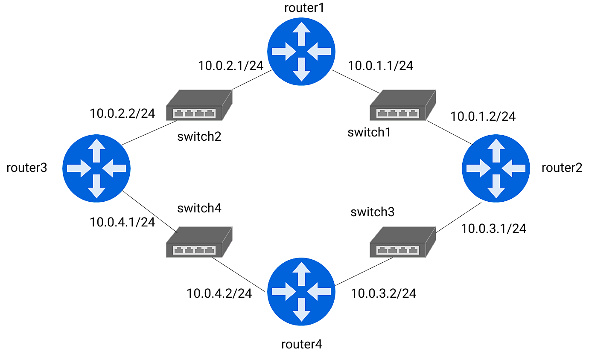

# Docker+Open vSwitchでネットワーク勉強用の環境を作る

## これは何?
Docker+Open vSwitchを使用して，ローカル環境上に仮想ルータと仮想スイッチのネットワークを構成するためのスクリプトです．

スクリプトによって作成されるネットワーク




## 環境作成時のメモ
- prerequisites
  - Docker [official site](https://www.docker.com/)
  - Open vSwitch [official site](https://www.openvswitch.org/)
  - ovs-docker [github](https://github.com/openvswitch/ovs/blob/master/utilities/ovs-docker)
- vyOS使いたかったがARMマシンに対応したコンテナの作成方法がわからなかった
- 結局CentOSのコンテナでルーティング
- そもそもルーティングに必要なソフトウェアが何なのかわからない状態から開始
- ルータとして動作させるためにip_forward機能を有効にする必要があった`docker run --sysctl net.ipv4.ip_forward=1 ...`
- `--sysctl`はコンテナ内のカーネルパラメータを設定するためのオプション
- 静的ルーティングのため`ip route add`でそれぞれのルータにルーティングテーブルを設定していく
- router1で`ip route add 10.0.3.0/24 via 10.0.1.2 dev eth0`として、router1->router4の通信ができるはずと思い`ping`で疎通確認するが、返信が返ってこない。。。
- router4->router1への経路を設定できていないからと気づくのに１週間かかる。
- router4で`ip route add 10.0.1.0/24 via 10.0.3.1 dev eth0`とした。
- router1->router4への`ping`が通った！


## ファイル

- [check_connection](./check_connection.sh) ルータ同士の疎通確認用スクリプト
- [create_routers](./create_routers.sh) ルータ(dockerコンテナ)とスイッチ(Open vSwitch)の作成
- [delete_ports](./delete_ports.sh) コンテナに割り当てたNICの削除
- [Dockerfile](./Dockerfile) ルータコンテナのDockerfile

## ip_forward確認コマンド
```bash
[root@3c4c80f60d77 /]# sysctl net.ipv4.ip_forward
net.ipv4.ip_forward = 1
```

## TODO

- 仮想ルータの部分をCentOSコンテナからFRR (Free Range Routing) に移行する
- ovs-docker導入方法の説明追記

## 参考記事

- [ネットワーク初心者の新卒がDockerでネットワークの勉強をしてみた](https://ameblo.jp/principia-ca/entry-12103919307.html)
- [スタティックルートの設定例 ～基本中の基本～](https://www.n-study.com/iprouting/cisco-static-route-example-the-very-basic/)
